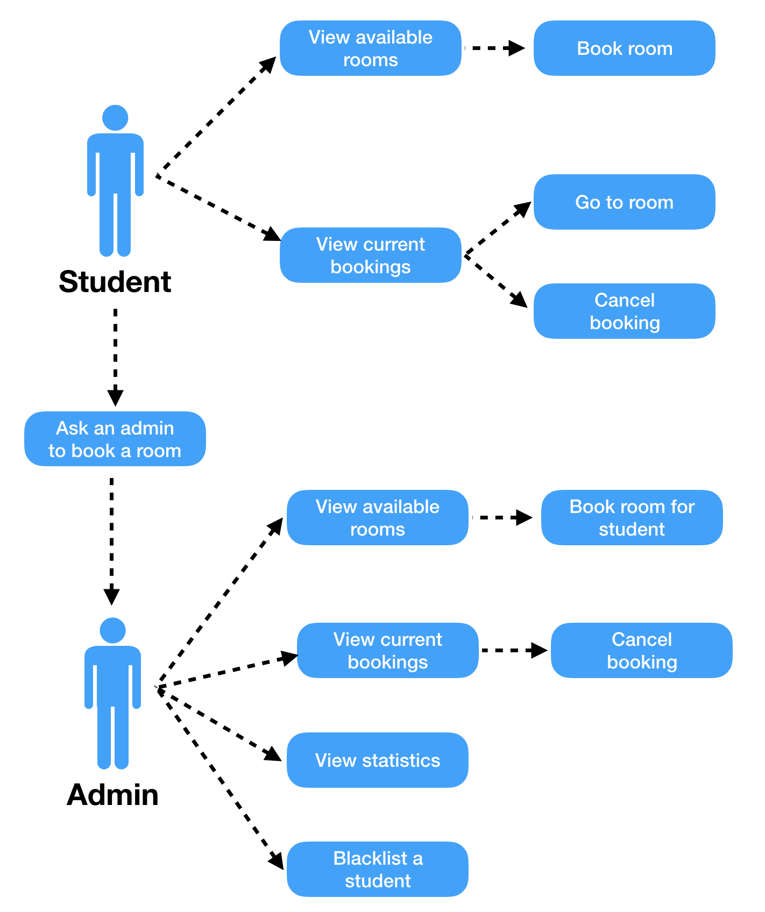

# Portfolio A

## Overview
The team’s assignment is to create a study space booking application for use by engineering students at the University of Bristol to book study spaces in the Queen’s building. This document provides our assessment of the project, and highlights some key parts at a high level. We will be constantly iterating and reflecting our work, so the design, flows and testing is be changed and improved upon after the completion of this document.

### Client
The client is the University of Bristol. More specifically, we will be working for the Faculty of Engineering, with our primary point of contact being Rahim Ahmed who is the Faculty of Engineering office manager. We will also be liaising with the IT team, both at a faculty level and a university level.

### Application Domain
The sector we are working in is the educational sector. Despite this, the team is treating this very much in the same way that you would treat any industry client.

### Key Reasons for the Product
Currently the Faculty of Engineering admin and library staff use crude methods for booking study spaces - google docs etc. On top of this, students must go in person to the library desk in order to book study spaces. The client is keen for us to create a solution that streamlines and automates the process, with students being able to book remotely, and admin staff only being needed to manage booking in exceptional circumstances. Other features and points to note:
* The product needs to be expandable to other study spaces outside of the Queen’s building in the future.
* The product is intended to be exclusively used by engineering undergraduates, with restrictions in place so that other university students cannot book study spaces in the Queen’s building.
* The product should integrate the single sign on system.
* Limits to how often and for how long students can book study spaces should be included in the product.
* There should be a separate admin page with admin functions.

### Vision of Product
The team hope to achieve an elegant and attractive solution to the client brief that is user friendly and aesthetically pleasing on the front end, and expandable, efficient and intuitive on the backend.

The front end will be a HTML, JavaScript and CSS based web-app with multiple pages and an admin page. This will be accessible from the University of Bristol website, and will allow all the functions that the client briefed us on.

The backend system will be housed on the Oracle cloud server systems. Here we will be using Java as our backend language, with SQL being our language for database integration. The database will be integrated with mySQL, and we will be using a two server model (web server / applications server).

## Requirements

### Stakeholders
##### Rahim Ahmed - Faculty Office Manager for the Engineering Department
The space booking app was requested by Rahim, and he laid out his own specification. Although Rahim is not and end-user, he must approve of the application and is responsible for it in the University. His priorities are in student and admin ease of use.

##### UoB Engineering Undergrads
These students form one side of the main end users. They themselves will be using the app to book the room.

##### UoB Engineering Office Admins / Librarians
These are the other side of the end users. They will use the app to monitor and manage the bookings, aiding the students and the process.

##### Chris Totthill - IT Manager for the Engineering Department
Chris is in charge of implementation and purchase of new applications, and his approval is also needed.

##### University IT and Maintenance Teams
They will be in charge of maintaining and updating the application post release. They will also deal with students needing help.

### High Level Use Case Diagrams

### Functional Requirements
* To be able book one of many study space rooms in the Engineering department, the core of the project.
* To log in with Single Sign On, fitting in with other University applications and increasing speed and ease of use for users
* To see the availability of rooms before booking, enabling users to plan ahead
* To have the ability to cancel bookings, both for users and admins
* For students to view their current bookings, and admins to view all bookings for management
* To be able to export bookings to eCalendars to improve ease of use for users
* For fairness and wellbeing, students will only be able to book up to 2 hours per day (10 a week)
* All required information should be stored on a database
* Have a seperate version for administrators, enabling them to manage the system
* There should be a page to show statistics about the use of the application, viewable by administrators only
* Administrators should be able to blacklist students
* Students not from the Engineering department should not be allowed to book rooms
* Have a terms and conditions page, highlighting the current policies of the rooms
* Have wellbeing information
* There should be a grid or table to display availability of rooms on specific days
* Administrators should be able to book rooms for students
* Once a room has been booked at a time, it cannot be booked by other students unless it is cancelled

### Non-Functional Requirements
* The time from loading the initial log in page completing a room booking should be very quick (1 minute max)
* The web page, database and servers should all be secure - meaning that they are not susceptible to malicious injection or information exposure.
* Ease of use should be a priority. No manual or instructions should be required by students in order to operate the application. Administrators have extra features so may need minimal coaching but the application should be intuitive enough for most to understand without.
* Accessible and fair to all users, rooms shouldn't be booked up by the same people constantly
* Efficient storage usage so that server costs are kept down
* The application and code should be easy to improve, extend and add features to. Code should be clean and well documented.
* The user interface should be aesthetically pleasing, to provide a positive experience so that users will want to use the app
* If the application is a success, other departments in the University may want the application to be extended to include them. The application should be able to scale up to accommodate this.
* The application should have a web user interface, and a server back-end
* Access to the application should be 24/7, with some allowance for updated and maintenance to the system itself
* Users should be able to access the application remotely, whether on the University network (Eduroam) or not.

### Flow Breakdown of Student Booking then Using a Room
#### Basic Flow¹
1. Student opens browser on phone/tablet/computer
1. Student enters the URL for the Study Space Booking Application
1. The student then clicks log in
1. The student then logs in via single sign on
1. At the home screen, the user chooses to click the "View rooms/Make a booking" button
1. After picking the day they want to book, the user is presented with a grid/table displaying the availability of all the rooms that day
1. The student may click a room to find out some more information
1. After deciding on a room and an available slot, the user clicks it
1. A confirmation page lets the user know that they have booked the room
1. The student then goes to the room

#### Alternative Flow²
1. The student does not have access to the a personal device
1. The student approaches a librarian/admin and asks them to book a room for them
1. The admin logs in to their admin account, and repeats the process as above but books for the student

#### Exceptional Flow³
* A student wishes to book a slot that another student has already booked
 * By the requirements, this is not allowed and so the student must find another, not already booked slot
* A student accidentally booked the wrong room
 * The student can cancel the room by viewing their bookings, and clicking cancel

### Flow Breakdown of Admin Viewing Statistics
#### Basic Flow¹
1. Admin opens browser on phone/tablet/computer
1. Admin enters the URL for the Study Space Booking Application
1. The admin then clicks log in
1. The admin then logs in via single sign on
1. At the admin home screen, the admin clicks the "View statistics" button
1. The admin is then presented with a set of options to view the statistics
1. After selecting the options they want, the relevant statistics are presented

#### Exceptional Flow³
* The admin accidentally presses "View bookings" instead of "View statistics"
 * They can just press the home button to go back to the home page and then press "View statistics" as intended

#### Key

* ¹ - Basic flow is the typical use of a user to perform the task
* ² - Alternative flow, a route that is different to the basic flow, but still reaches the same result
* ³ - Exceptional flows are where the user takes a route through the application that is not intended.

## Development Testing

The Java application server backend which deals with processing input, communicating between the web server and database server, will be tested using JUnit. There will be assertions on each function, checking the correct output is given for a specified input.

For the Javascript front end, we will be using a Javascript testing framework such as Mocha. We will also be providing continuous iterations of the front end to the client, such that improvement and alterations can easily be made.

Part of our JUnit tests will check that the SQL queries are correct. We will also use DbUnit, a JUnit extension to ensure that the database is correct.

#### Possible Testing frameworks:
* JUnit
* DbUnit
* Mocha

#### Challenges:  

The API will be difficult to test because it will be developed by us, rather than coming from an external source. To overcome this we will create our own, thorough tests.

Often the front end can be hard to test, but using a framework such as mocha will enable us to ensure that there are no issues such as browser incompatibility.

## OO Design and UML
